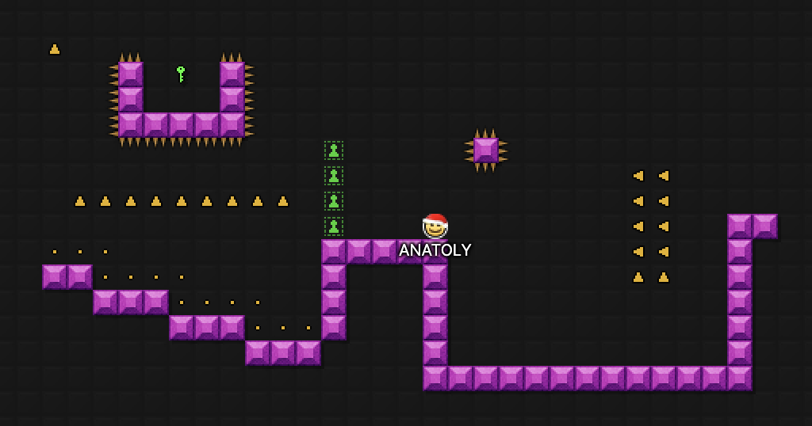

# The Line

    
    <i>Compete with other players on a moving snake tail, beat minigames and survive the longest.</i>

# Admin Commands

- `!start` Start the game
- `!last` Announce the last game. Finishes automatically after everyone is eliminated.
- `!stop` Pause the tile advancement immediately after the tile was placed. Note: While the game is paused, eliminations do not occur. It is not recommended for usage.
- `!continue` Continue the paused tile advancement.
- `!*empty` Create a completely empty arena.
- `!*build` Create an empty arena with a starting platform.
- `!*piece <n>` Advance `n` next pieces. Do not use while game is running.